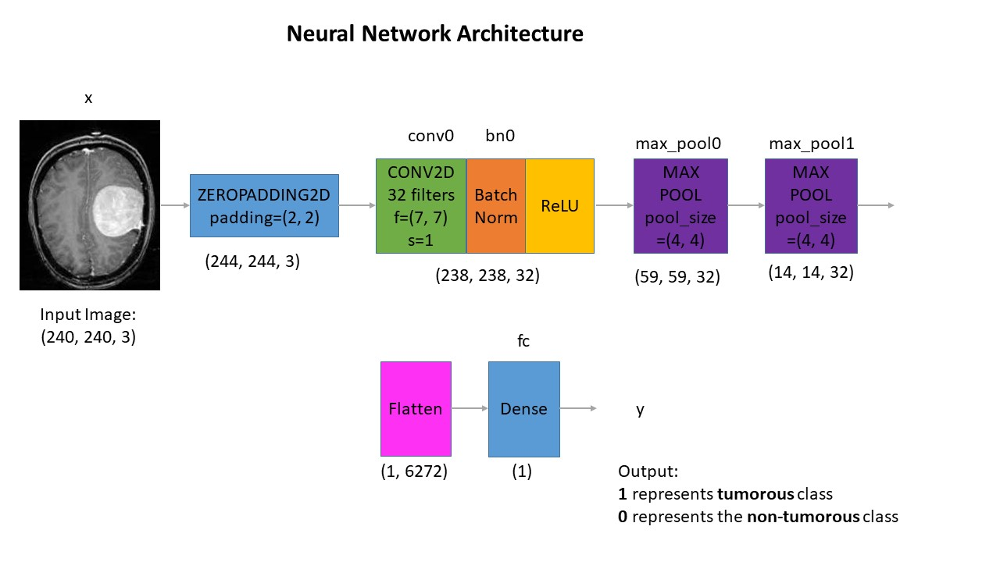
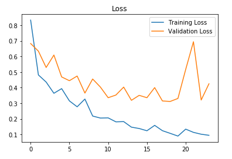
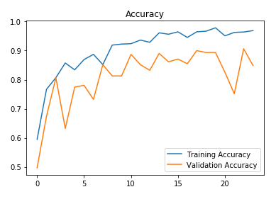

# Brain Tumor Detection Module

AI-powered brain tumor detection using Convolutional Neural Networks for MRI scan analysis.

## Overview

This module uses a custom CNN model built with TensorFlow/Keras to detect brain tumors from MRI scans. The model achieves **88.7% accuracy** on test data with an F1 score of **0.88**.

## Features

- 🧠 **Binary Classification**: Detects presence/absence of brain tumors
- 📊 **High Accuracy**: 88.7% test accuracy, 91% validation accuracy
- 🖼️ **Image Preprocessing**: Automatic brain region cropping and normalization
- 📈 **Training Visualization**: Loss and accuracy plots
- 💾 **Model Persistence**: Save and load trained models

## Dataset

**Original Data:**
- 155 tumor-positive MRI images
- 98 tumor-negative MRI images
- Total: 253 images

**After Data Augmentation:**
- 1,085 tumor-positive images
- 980 tumor-negative images
- Total: 2,065 images

> **Note**: Raw images and augmented data are excluded from Git due to size. Download from Kaggle or request access.

## Model Architecture

```
Input (240x240x3)
    ↓
Zero Padding (2x2)
    ↓
Conv2D (32 filters, 7x7, stride=1)
    ↓
Batch Normalization
    ↓
ReLU Activation
    ↓
MaxPooling2D (4x4, stride=4)
    ↓
MaxPooling2D (4x4, stride=4)
    ↓
Flatten
    ↓
Dense (1 unit, sigmoid)
```



## Data Preprocessing

For each MRI image:
1. **Crop**: Extract brain region only
2. **Resize**: Scale to 240x240 pixels
3. **Normalize**: Scale pixel values to [0, 1]

## Data Split

- **Training**: 70%
- **Validation**: 15%
- **Testing**: 15%

## Installation

```bash
cd Brain-Tumor-Detection

# Install dependencies
pip install tensorflow opencv-python pillow numpy pandas matplotlib jupyter
```

## Usage

### Training the Model

```python
# Open Jupyter notebook
jupyter notebook "Brain Tumor Detection.ipynb"

# Follow the notebook steps to train
```

### Using Pre-trained Model

```python
from tensorflow.keras.models import load_model
import cv2
import numpy as np

# Load the best model
model = load_model('models/cnn-parameters-improvement-23-0.91.model')

# Load and preprocess image
img = cv2.imread('path/to/mri_scan.jpg')
img = cv2.resize(img, (240, 240))
img = img / 255.0
img = np.expand_dims(img, axis=0)

# Predict
prediction = model.predict(img)
has_tumor = prediction[0][0] > 0.5

print(f"Tumor detected: {has_tumor}")
print(f"Confidence: {prediction[0][0]:.2%}")
```

### Running Detection Script

```bash
python run_detection.py --image path/to/mri_scan.jpg
```

## Training Results

**Performance Metrics:**

| Metric    | Validation | Test |
|-----------|------------|------|
| Accuracy  | 91%        | 89%  |
| F1 Score  | 0.91       | 0.88 |

**Training Details:**
- Epochs: 24
- Best model: Epoch 23
- Optimizer: Adam
- Loss: Binary Crossentropy

### Training Plots




## Files Structure

```
Brain-Tumor-Detection/
├── Brain Tumor Detection.ipynb   # Main training notebook
├── Data Augmentation.ipynb        # Data augmentation notebook
├── run_detection.py               # Inference script
├── convnet_architecture.jpg       # Architecture diagram
├── Accuracy.PNG                   # Training accuracy plot
├── Loss.PNG                       # Training loss plot
├── models/                        # Trained model files (gitignored)
│   └── cnn-parameters-improvement-23-0.91.model
├── yes/                          # Positive samples (gitignored)
├── no/                           # Negative samples (gitignored)
├── augmented data/               # Augmented dataset (gitignored)
└── README.md                     # This file
```

## Integration with CuraGenie

This module is integrated into the main CuraGenie platform through:

- **Backend API**: `backend/api/mri_analysis.py`
- **Image Upload**: `backend/api/local_upload.py`
- **Frontend**: `frontend/src/app/mri-analysis/`

The model is loaded and used for real-time MRI analysis in the web application.

## Model Files

Pre-trained models are stored in the `models/` directory:

```python
# Load the best performing model
best_model = load_model('models/cnn-parameters-improvement-23-0.91.model')
```

> **Note**: Model files (*.model, *.h5) are excluded from Git due to size. Download separately or train your own.

## Data Augmentation

Applied techniques:
- Rotation
- Width/Height shift
- Shear transformation
- Zoom
- Horizontal flip

See `Data Augmentation.ipynb` for details.

## Why This Architecture?

Initial attempts with transfer learning (ResNet50, VGG16) led to overfitting due to:
- Small dataset size
- Model complexity
- Computational constraints

**Solution**: Custom lightweight CNN trained from scratch
- ✅ Better suited for dataset size
- ✅ Lower computational requirements
- ✅ No overfitting
- ✅ Good performance (88.7% accuracy)

## Requirements

```
tensorflow>=2.15.0
opencv-python>=4.10.0
numpy>=1.25.0
pandas>=2.1.0
matplotlib>=3.8.0
pillow>=10.1.0
jupyter>=1.0.0
```

## Medical Disclaimer

⚠️ **This model is for educational and research purposes only.** It should NOT be used for actual medical diagnosis. Always consult qualified healthcare professionals for medical decisions.

## Contributing

Contributions are welcome! Please:
1. Fork the repository
2. Create a feature branch
3. Submit a pull request

## License

See main project LICENSE file.

## Acknowledgments

- Original dataset from Kaggle
- TensorFlow/Keras team
- CuraGenie project contributors

## References

- [Deep Learning for Medical Image Analysis](https://www.tensorflow.org/tutorials/images/classification)
- [CNN Architectures](https://cs231n.github.io/convolutional-networks/)
- [Brain Tumor Classification Research](https://arxiv.org/)

---

Built with ❤️ as part of the CuraGenie AI Healthcare Platform
